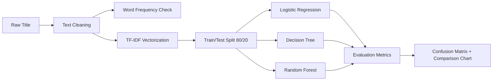

# Model-Training
<div align="center">

# 📰 News tfidf -ML Classification

**Predicting news categories from headlines using TF-IDF + Machine Learning**


</div>
---

## 📌 Overview

This project builds a **text classification pipeline** that predicts a news
article's **Category** — `Business`, `Markets`, `Politics`, `Technology`,
`Health`, or `Energy` — using only its **Title**.

The pipeline converts raw headline text into numeric features with **TF-IDF**,
then trains and compares three classic machine learning models to find the
best performer.

---

## 🗂️ Dataset

| Column     | Description                          |
|------------|---------------------------------------|
| `URL`      | Source article link (not used in model) |
| `Title`    | Headline text — **input feature**     |
| `Category` | Target label to predict               |

- **5000** news rows, 6 category classes
- Source file: `News_Classification_Labeling.xlsx`

> ⚠️ If the dataset shouldn't be public, add it to `.gitignore` instead of committing it.

---

## ⚙️ Pipeline



1. **Text cleaning** — lowercase, strip punctuation/numbers, remove extra spaces
2. **Word frequency check** — quick sanity-check word count before vectorizing
3. **TF-IDF vectorization** — `TfidfVectorizer` (max 3000 features, English stopwords removed)
4. **Train/test split** — 80/20, stratified by category
5. **Model training** — Logistic Regression, Decision Tree, Random Forest
6. **Evaluation** — Accuracy, Precision, Recall, F1-score (weighted) + per-class report
7. **Visualization** — confusion matrix per model + comparison bar chart

---

---

## 📊 Results

| Model                | Accuracy | Precision | Recall | F1 Score |
|------------------------|:--------:|:---------:|:------:|:--------:|
| 🥇 **Random Forest**    | 0.647    | 0.6547    | 0.647  | **0.6445** |
| 🥈 Logistic Regression  | 0.645    | 0.6727    | 0.645  | 0.6349   |
| 🥉 Decision Tree        | 0.580    | 0.5825    | 0.580  | 0.5789   |

**🏆 Best model: Random Forest** — marginally ahead of Logistic Regression,
with both clearly outperforming Decision Tree (which overfits on
high-dimensional TF-IDF data).

> **Note:** Minority classes (`Energy`, `Health`) show lower recall due to
> class imbalance — each makes up only ~2.5–3% of the dataset.

### Visual outputs

| Confusion Matrices | Model Comparison |
|---|---|
| `outputs/confusion_matrix_random_forest.png` | `outputs/model_comparison_chart.png` |
| `outputs/confusion_matrix_logistic_regression.png` | |
| `outputs/confusion_matrix_decision_tree.png` | |

*(Embed these images here once generated — see below)*

```markdown


```

---

## 📁 Project Structure

```
.
├── classification.py                    # main pipeline script
├── requirements.txt                     # dependencies
├── README.md
├── News_Classification_Labeling.xlsx    # dataset (or gitignored)
└── outputs/
    ├── confusion_matrix_logistic_regression.png
    ├── confusion_matrix_decision_tree.png
    ├── confusion_matrix_random_forest.png
    ├── model_comparison_chart.png
    └── model_comparison.csv
```
---

## 🛠️ Tech Stack

`Python` · `pandas` · `scikit-learn` · `matplotlib` · `TF-IDF`
